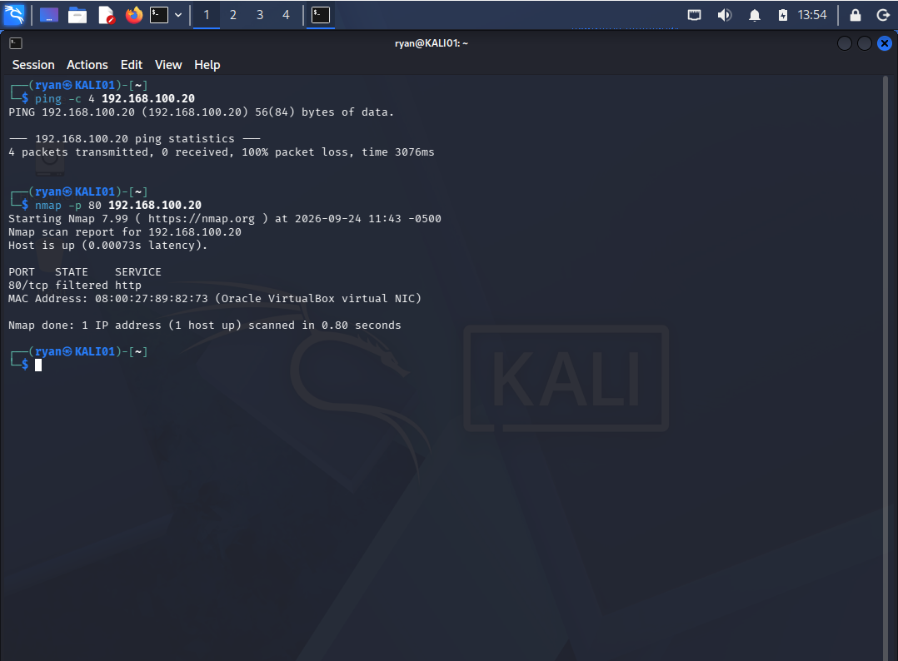
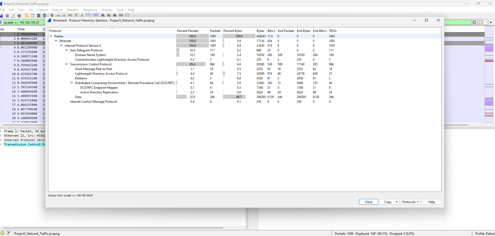
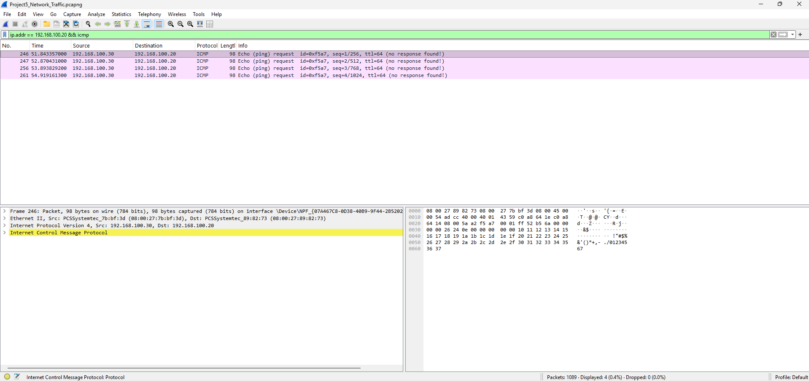
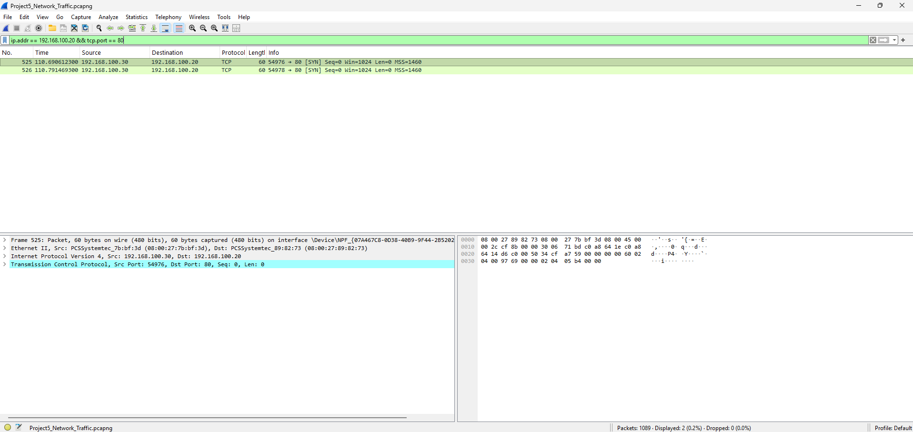
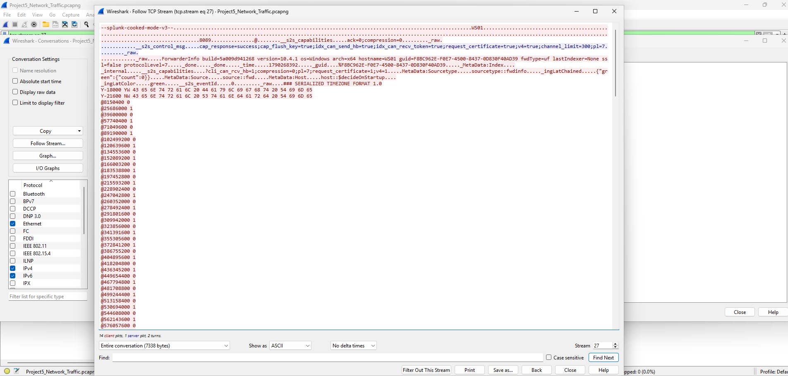
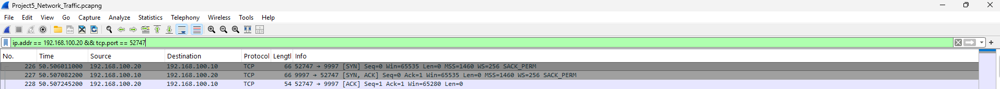
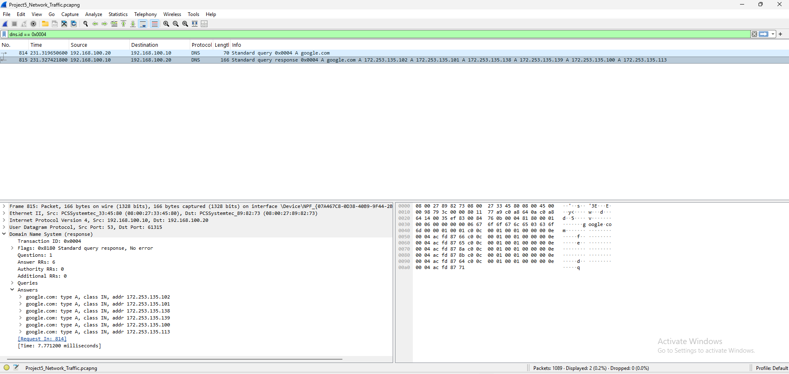
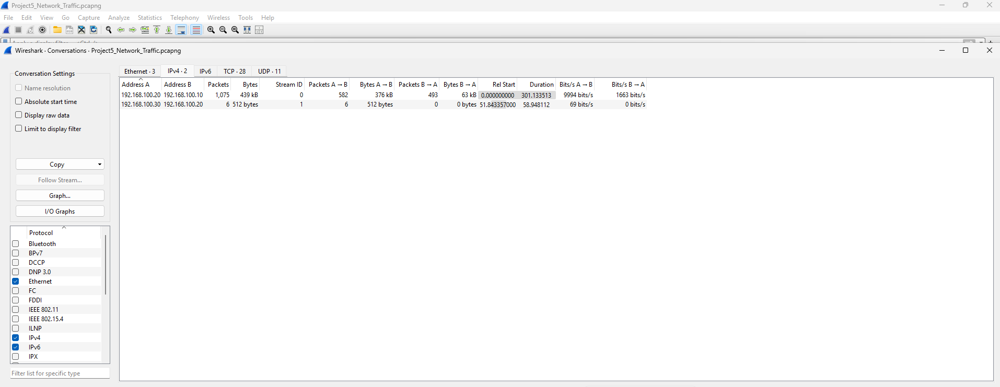

# Wireshark Network Traffic Analysis

## Project Overview

This project focused on analyzing network traffic with Wireshark inside my Active Directory home lab. I generated ICMP and TCP traffic from KALI01 toward WS01, captured the traffic directly from the Windows workstation, and investigated the resulting packets using Wireshark.

The investigation included analyzing ICMP Echo Requests, TCP SYN activity, successful TCP connections, DNS query and response traffic, network conversations, and application-level data using Follow TCP Stream. I also used Wireshark statistics and Expert Information to identify traffic patterns that warranted further investigation.

The goal of this project was to gain hands-on experience with packet analysis and develop a more evidence-driven investigation process similar to what a SOC or cybersecurity analyst may use when investigating suspicious network activity.

## Lab Environment

The project was performed inside an isolated Active Directory home lab running in Oracle VirtualBox.

| System | Role | IP Address |
|---|---|---|
| DC01 | Windows Server 2025 / Active Directory / Splunk Enterprise | 192.168.100.10 |
| WS01 | Windows 10 Pro Domain Workstation / Wireshark / Sysmon / Splunk Universal Forwarder | 192.168.100.20 |
| KALI01 | Kali Linux Attack and Testing Machine | 192.168.100.30 |

### Tools Used

- Wireshark
- Npcap
- Kali Linux
- Nmap
- Windows 10
- Windows Server 2025
- Oracle VirtualBox

## Traffic Generation

To create network activity for analysis, I generated ICMP and TCP traffic from KALI01 (`192.168.100.30`) toward WS01 (`192.168.100.20`).

The following commands were executed from KALI01:

- `ping -c 4 192.168.100.20` — generated four ICMP Echo Requests toward WS01.
- `nmap -p 80 192.168.100.20` — generated TCP SYN traffic toward port 80 on WS01.

The ping returned 100% packet loss, while Nmap reported TCP port 80 as `filtered`. Rather than relying only on the command-line results, I later used the packet capture to determine what traffic actually reached WS01.

## Packet Capture

Network traffic was captured directly from WS01 using Wireshark on the workstation's Ethernet interface. Capturing from WS01 provided visibility into traffic sent to and from the workstation during the investigation.

The capture was saved as `Project5_Network_Traffic.pcapng` and contained 1,089 packets. The raw PCAP is not included in this public repository; relevant packet evidence and investigation results are documented through the screenshots below.

## Wireshark Investigation

### Protocol Hierarchy

I began the investigation by reviewing Wireshark's Protocol Hierarchy statistics to understand the overall composition of the traffic involving WS01.

The filtered capture contained 1,081 packets involving WS01. TCP accounted for the majority of the observed traffic, followed by UDP and DNS, with a smaller amount of ICMP traffic also present. Additional protocols associated with the Active Directory environment, including LDAP, Kerberos, and DCE/RPC, were also visible.

Reviewing the protocol distribution provided an initial high-level view of the capture before narrowing the investigation to specific hosts and traffic patterns.

### ICMP Analysis

I filtered the capture for ICMP traffic involving WS01 and identified four ICMP Echo Requests sent from KALI01 (`192.168.100.30`) to WS01 (`192.168.100.20`).

No corresponding ICMP Echo Replies from WS01 were observed. This confirmed that the requests successfully reached WS01's network interface even though the `ping` command on KALI01 reported 100% packet loss.

This demonstrated why packet-level analysis can provide additional context beyond what is visible from the system generating the traffic.

**Display Filter:**
`ip.addr == 192.168.100.20 && icmp`

### TCP Port 80 Analysis

I next investigated the TCP traffic generated by the Nmap scan from KALI01 toward port 80 on WS01.

The capture showed two TCP SYN packets from KALI01 (`192.168.100.30`) to WS01 (`192.168.100.20`) using destination port 80. The packets originated from source ports `54976` and `54978`.

No SYN/ACK or RST response from WS01 was observed. This behavior is consistent with the traffic being silently filtered or dropped, which also aligns with Nmap reporting port 80 as `filtered`. However, the packet capture alone does not establish the specific filtering mechanism responsible.

**Display Filter:**
`ip.addr == 192.168.100.20 && tcp.port == 80`

### Splunk TCP Stream Analysis

I then investigated communication between WS01 (`192.168.100.20`) and DC01 (`192.168.100.10`) over TCP port `9997`, which is used in the lab for Splunk forwarding.

The conversation contained 31 TCP packets. Using **Follow TCP Stream** revealed readable application-identifying strings including `splunk-cooked-mode` and `SplunkUniversalForwarder`, providing additional evidence that the connection was associated with the Splunk Universal Forwarder running on WS01.

This demonstrated how application traffic can be validated using packet contents rather than relying solely on the destination port.

### TCP Three-Way Handshake Analysis

I examined a successful TCP connection between WS01 (`192.168.100.20`) and DC01 (`192.168.100.10`) on TCP port `9997`.

The packet sequence showed the complete TCP three-way handshake:

1. WS01 → DC01: `SYN`
2. DC01 → WS01: `SYN, ACK`
3. WS01 → DC01: `ACK`

Unlike the unanswered TCP SYN probes sent from KALI01 to port 80, this sequence demonstrated a successful TCP connection being established between WS01 and DC01.

**Display Filter:**
`ip.addr == 192.168.100.20 && tcp.port == 52747`

### DNS Analysis

I analyzed DNS traffic between WS01 (`192.168.100.20`) and DC01 (`192.168.100.10`) to observe how hostname resolution appeared at the packet level.

WS01 generated both A and AAAA queries for `google.com`. I also observed DNS suffix search behavior where `google.com.home.local` was queried before the standard `google.com` lookup.

I isolated the A record lookup for `google.com` using DNS Transaction ID `0x0004`. The matching query and response showed WS01 sending the request to DC01 on UDP port 53 and receiving a response containing six IPv4 addresses for `google.com`.

Correlating the query and response through the transaction ID demonstrated how DNS activity can be traced at the packet level rather than viewing individual DNS packets in isolation.

**Display Filter:**
`dns.id == 0x0004`

### Conversation Analysis

Rather than relying only on prior knowledge of the traffic I generated, I used **Statistics → Conversations** to identify communication patterns that would stand out during an investigation.

The IPv4 Conversations view showed that KALI01 (`192.168.100.30`) sent six packets to WS01 (`192.168.100.20`) while WS01 sent zero packets back. This one-way communication pattern stood out from the other conversations in the capture and provided a reason to investigate the traffic further.

Pivoting from the conversation into the packets revealed that the six packets consisted of four ICMP Echo Requests and two TCP SYN packets targeting port 80.

The one-way communication alone does not establish malicious activity. However, it demonstrates how conversation statistics can be used to identify unusual communication patterns and determine where deeper packet analysis may be warranted.

## Key Findings

- Four ICMP Echo Requests from KALI01 reached WS01, but no corresponding Echo Replies were observed.
- Two TCP SYN packets from KALI01 targeted port 80 on WS01 without receiving a SYN/ACK or RST response.
- A successful TCP three-way handshake was observed between WS01 and DC01 on the Splunk forwarding connection.
- Following the TCP stream revealed `splunk-cooked-mode` and `SplunkUniversalForwarder` strings, supporting identification of the traffic as Splunk communication.
- DNS analysis showed WS01 successfully querying DC01 for `google.com`, with the query and response correlated using DNS Transaction ID `0x0004`.
- IPv4 Conversation statistics identified one-way communication from KALI01 to WS01, providing an evidence-based starting point for deeper investigation.
- Wireshark Expert Information was used as an additional triage resource, while packet context was used to determine the significance of individual warnings and events.

## Skills Demonstrated

- Network packet capture and analysis using Wireshark
- Wireshark display filtering to isolate relevant network traffic
- TCP/IP and network protocol analysis
- TCP flag analysis and three-way handshake identification
- ICMP Echo Request and response analysis
- DNS query and response analysis
- DNS transaction correlation using Transaction IDs
- Network endpoint and conversation analysis
- TCP stream reconstruction using Follow TCP Stream
- Application traffic identification using packet contents
- Interpretation of Wireshark Expert Information
- Distinguishing unusual network behavior from confirmed malicious activity
- Evidence-based network traffic investigation

## Lessons Learned

This project helped turn networking concepts I had previously learned through coursework and certification study into hands-on experience. Concepts such as TCP handshakes, DNS resolution, ICMP traffic, TCP flags, and network conversations became much easier to understand after observing them directly in packet captures generated by my own lab systems.

One of the most important lessons came from the ICMP testing. Although KALI01 reported 100% packet loss, Wireshark showed that all four Echo Requests had successfully reached WS01. This reinforced the importance of examining multiple sources of evidence rather than relying on the output of a single tool.

I also became more comfortable using Wireshark display filters, protocol statistics, conversation analysis, Follow TCP Stream, and Expert Information to move from a large packet capture toward specific traffic requiring investigation.

From an analyst perspective, the project reinforced an evidence-driven workflow: begin with broader traffic patterns, identify communication that stands out, pivot into the relevant packets, and use protocol behavior and packet context to determine what actually occurred without assuming that unusual behavior is automatically malicious.

## Final Documentation

A complete project report containing the lab setup, investigation methodology, packet analysis, findings, screenshots, and lessons learned is available below.

[View the Full Wireshark Network Traffic Analysis Project Report](Wireshark_Network_Traffic_Analysis_Project_Report.pdf)

